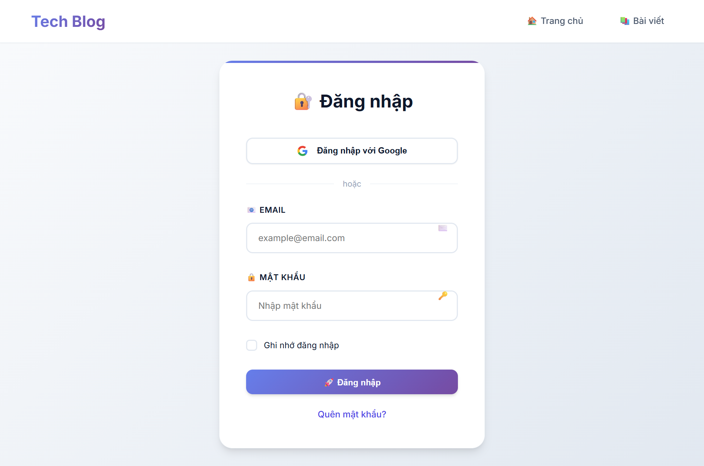
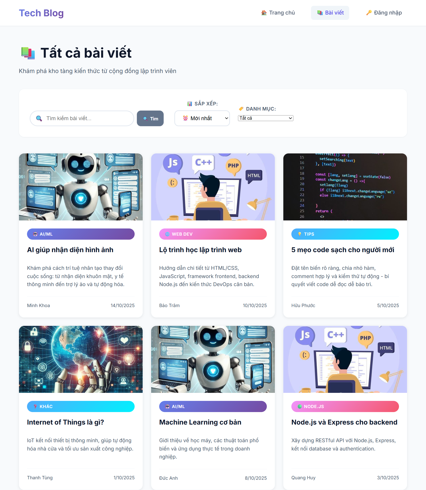
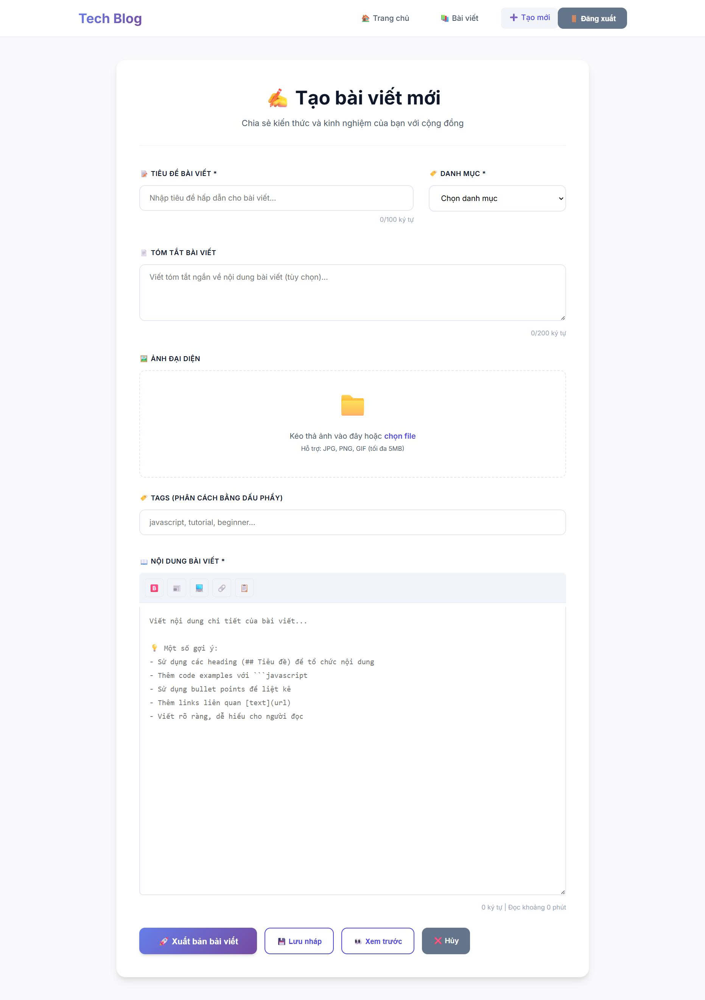
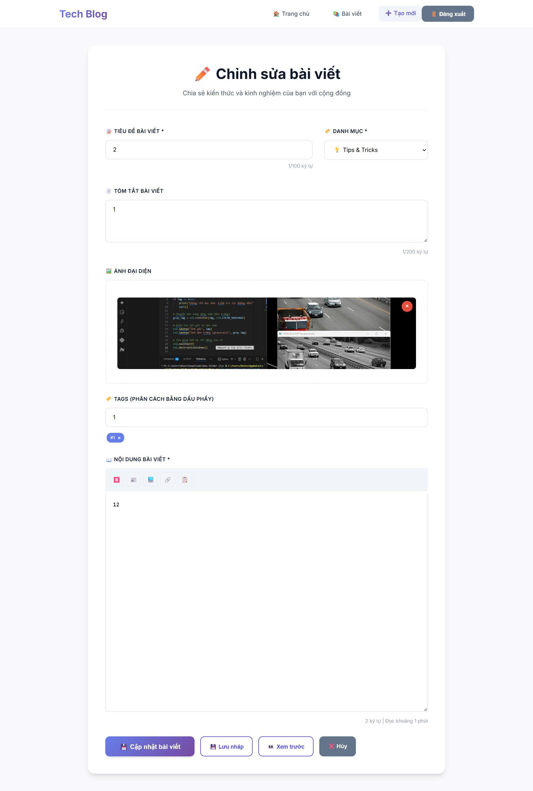
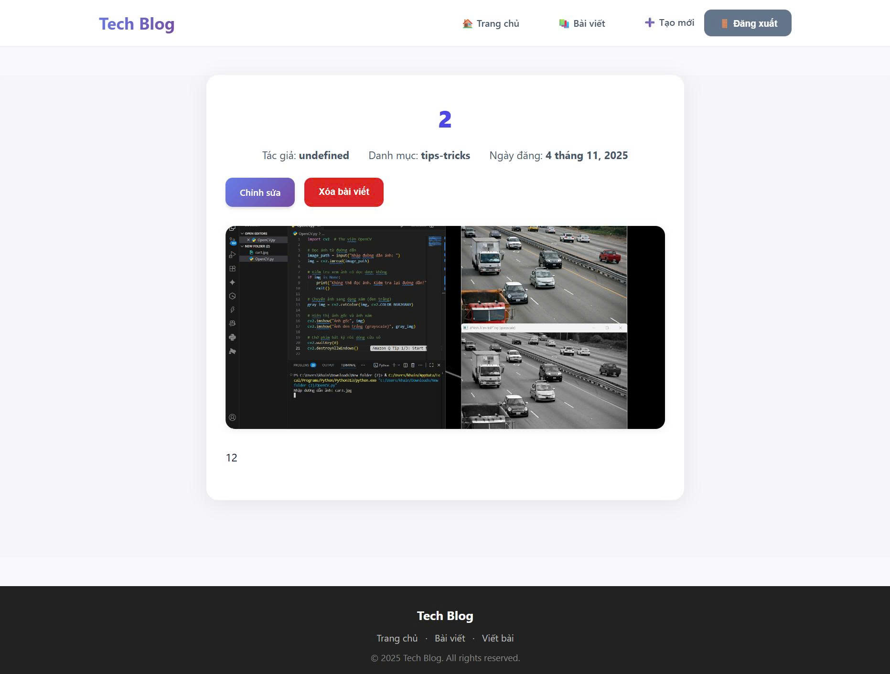

# E-LEARNING 4 - BLOG CHIA SẺ KIẾN THỨC CÔNG NGHỆ

<div align="center">

**Ứng dụng web chia sẽ kiến thức công nghệ**

</div>

---

## Mô tả tổng quan

**E-Learning 4 Blog** là một nền tảng blog mini được xây dựng theo kiến trúc **API-first**, nơi backend và frontend hoàn toàn tách biệt và giao tiếp qua RESTful API. Dự án được thiết kế dành cho **admin** quản lý và chia sẻ kiến thức công nghệ.

### Mục đích

- Học tập và thực hành xây dựng ứng dụng web fullstack
- Hiểu rõ kiến trúc API-first và tách biệt frontend/backend
- Thực hành CRUD operations với Laravel Framework
- Làm việc với authentication sử dụng Laravel Sanctum
- Quản lý database với MySQL và migrations


### Kiến trúc hệ thống

<details>
<summary>📂 Click để xem kiến trúc hệ thống chi tiết</summary>

```plaintext
┌─────────────────────────────────────────────────────────────────┐
│                         CLIENT (Browser)                        │
│                    HTML + CSS + JavaScript                      │
└──────────────────────────┬──────────────────────────────────────┘
                           │
                           │ HTTP/HTTPS (TCP/IP)
                           │ RESTful API Calls
                           │
                           ▼
┌─────────────────────────────────────────────────────────────────┐
│                    BACKEND API SERVER                           │
│                    Laravel Framework (PHP)                      │
│  ┌──────────────────────────────────────────────────────────┐   │
│  │  Routes (api.php)                                        │   │
│  │    ▼                                                     │   │
│  │  Controllers (AuthController, BlogController)            │   │
│  │    ▼                                                     │   │
│  │  Models (User, Blog, Category)                           │   │
│  │    ▼                                                     │   │
│  │  Database Layer (Eloquent ORM)                           │   │
│  └──────────────────────────────────────────────────────────┘   │
│                                                                 │
│  Authentication: Laravel Sanctum (Token-based)                  │
└──────────────────────────┬──────────────────────────────────────┘
                           │
                           │ TCP/IP Connection
                           │ MySQL Protocol
                           │
                           ▼
┌───────────────────────────────────────────────────────────────┐
│                      DATABASE SERVER                          │
│                         MySQL 8.0                             │
│  ┌─────────────────────────────────────────────────────────┐  │
│  │  Tables:                                                │  │
│  │    • users (id, name, email, password, role)            │  │
│  │    • blogs (id, title, content, image_url, author_id)   │  │
│  │    • categories (id, name)                              │  │
│  │    • personal_access_tokens (for Sanctum)               │  │
│  └─────────────────────────────────────────────────────────┘  │
└───────────────────────────────────────────────────────────────┘
```

</details>

---


### Luồng hoạt động của giao thức TCP trong dự án

<details>
<summary>📂 Click để xem luồng hoạt động giao thức TCP chi tiết</summary>

```plaintext
CLIENT                          BACKEND API                     DATABASE
  │                                  │                              │
  │  1. HTTP Request (TCP)           │                              │
  │  POST /api/login                 │                              │
  ├─────────────────────────────────►│                              │
  │                                  │  2. Query via TCP            │
  │                                  │  SELECT * FROM users         │
  │                                  ├─────────────────────────────►│
  │                                  │                              │
  │                                  │  3. Response via TCP         │
  │                                  │◄─────────────────────────────┤
  │                                  │  User data                   │
  │  4. HTTP Response (TCP)          │                              │
  │  {token, user}                   │                              │
  │◄─────────────────────────────────┤                              │
  │                                  │                              │
  │  5. HTTP Request (TCP)           │                              │
  │  GET /api/blogs                  │                              │
  │  Header: Bearer {token}          │                              │
  ├─────────────────────────────────►│                              │
  │                                  │  6. Verify token             │
  │                                  │  Query blogs                 │
  │                                  ├─────────────────────────────►│
  │                                  │                              │
  │                                  │  7. Blogs data               │
  │                                  │◄─────────────────────────────┤
  │  8. HTTP Response (TCP)          │                              │
  │  {blogs: [...]}                  │                              │
  │◄─────────────────────────────────┤                              │
  │                                  │                              │
```

**Giải thích:**

- **HTTP/HTTPS** chạy trên nền **TCP/IP** đảm bảo kết nối tin cậy
- **Three-way handshake** của TCP thiết lập kết nối trước khi truyền dữ liệu
- **MySQL** sử dụng TCP port 3306 để giao tiếp với Laravel
- **Laravel Sanctum** xác thực qua Bearer Token trong HTTP headers

</details>

---

## Tính năng chính

### Authentication
- **Đăng nhập Admin** với email và password
- **Xác thực Token** sử dụng Laravel Sanctum
- **Đăng xuất** an toàn (revoke tokens)

### Quản lý Blog (CRUD)
- **Tạo bài viết mới** (Create) - Admin only
- **Xem danh sách blog** (Read) - Public
- **Xem chi tiết blog** (Read) - Public
- **Cập nhật bài viết** (Update) - Author only
- **Xóa bài viết** (Delete) - Author only

### Upload & Quản lý Media
- Upload ảnh cho bài viết
- Preview ảnh trước khi đăng
- Lưu trữ ảnh trong `storage/app/public/blogs`

### Tìm kiếm & Sắp xếp
- Tìm kiếm theo tiêu đề bài viết
- Sắp xếp theo ngày tạo (mới nhất/cũ nhất)
- Filter theo danh mục (categories)

### Quản lý Danh mục
- Danh mục blog (Lập trình Web, AI, Bảo mật, v.v.)
- Relationship giữa Blog và Category

---

## Công nghệ & Tools

### Backend
| Công nghệ | Phiên bản | Mục đích |
|-----------|-----------|----------|
| **PHP** | 8.0+ | Ngôn ngữ lập trình server-side |
| **Laravel** | 10.x | Framework PHP hiện đại |
| **Laravel Sanctum** | Latest | API Authentication (Token-based) |
| **MySQL** | 8.0 | Hệ quản trị cơ sở dữ liệu |
| **Composer** | Latest | Dependency manager cho PHP |

### Frontend
| Công nghệ | Mô tả |
|-----------|-------|
| **HTML5** | Cấu trúc trang web |
| **CSS3** | Styling và responsive design |
| **JavaScript (ES6+)** | Logic xử lý client-side |
| **Fetch API** | Gọi RESTful API từ backend |

### Development Tools
| Tool | Mục đích |
|------|----------|
| **XAMPP** | Local server (Apache, MySQL, PHP) |
| **Postman** | Test API endpoints |
| **VS Code** | Code editor |
| **Git** | Version control |
| **phpMyAdmin** | Quản lý MySQL database |

---

## Cấu trúc thư mục

<details>
<summary>📂 Click để xem cấu trúc chi tiết</summary>

```plaintext
elearning4-blog/
│
├── backend/                           # Laravel API Backend
│   ├── app/
│   │   ├── Http/
│   │   │   ├── Controllers/
│   │   │   │   └── Api/
│   │   │   │       ├── AuthController.php     # Login, Logout, User info
│   │   │   │       └── BlogController.php     # CRUD Blog + Upload
│   │   │   ├── Middleware/
│   │   │   └── Requests/
│   │   │       ├── LoginRequest.php           # Validate login
│   │   │       ├── StoreBlogRequest.php       # Validate create blog
│   │   │       ├── UpdateBlogRequest.php      # Validate update blog
│   │   │       └── UploadImageRequest.php     # Validate image upload
│   │   └── Models/
│   │       ├── User.php                       # User model
│   │       ├── Blog.php                       # Blog model
│   │       └── Category.php                   # Category model
│   ├── config/
│   │   ├── cors.php                           # CORS configuration
│   │   ├── database.php                       # Database config
│   │   └── sanctum.php                        # Sanctum config
│   ├── database/
│   │   ├── migrations/                        # Database schema migrations
│   │   └── seeders/                           # Database seeders
│   ├── routes/
│   │   └── api.php                            # API routes definition
│   ├── storage/
│   │   └── app/public/blogs/                  # Uploaded images
│   ├── .env                                   # Environment variables
│   ├── composer.json                          # PHP dependencies
│   └── artisan                                # Laravel CLI
│
├── frontend/                          # Static HTML/CSS/JS
│   ├── css/
│   │   └── style.css                          # Main stylesheet
│   ├── js/
│   │   ├── auth_api.js                        # Authentication API calls
│   │   ├── blog_api.js                        # Blog API calls
│   │   ├── login.js                           # Login page logic
│   │   ├── blogs.js                           # Blog list page logic
│   │   ├── create-blog.js                     # Create/Edit blog logic
│   │   ├── blog-detail.js                     # Blog detail page logic
│   │   └── main.js                            # Common utilities
│   ├── image/                                 # Static images
│   ├── index.html                             # Homepage
│   ├── login.html                             # Login page
│   ├── blogs.html                             # Blog listing page
│   ├── blog-detail.html                       # Blog detail page
│   └── create-blog.html                       # Create/Edit blog page
│
├── postman/
│   └── Blog_API_Fixed.postman_collection.json # Postman test collection
│
├── reset-database.sql                 # SQL script to reset database
└── README.md                          # This file
```

</details>

---

## Hướng dẫn cài đặt

### Yêu cầu hệ thống

- **PHP**: >= 8.0
- **Composer**: Latest version
- **MySQL**: >= 8.0
- **XAMPP**: hoặc Apache + MySQL stack
- **Node.js**: (Optional, nếu cần build tools)
- **Web Browser**: Chrome, Firefox, Edge (latest)

---

### BƯỚC 1: Cài đặt Backend (Laravel)

#### 1.1. Clone repository

```bash
git clone https://github.com/QuyTran25/elearning4-blog.git
cd elearning4-blog
```

#### 1.2. Cài đặt dependencies PHP

```bash
cd backend
composer install
```

#### 1.3. Tạo file môi trường

```bash
cp .env.example .env
php artisan key:generate
```

#### 1.4. Cấu hình Database

Mở file `backend/.env` và cấu hình:

```env
APP_NAME=e4-Blog
APP_ENV=local
APP_DEBUG=true
APP_URL=http://127.0.0.1:8000

DB_CONNECTION=mysql
DB_HOST=127.0.0.1
DB_PORT=3306
DB_DATABASE=e4-blog
DB_USERNAME=root
DB_PASSWORD=
```

#### 1.5. Tạo và import Database

**Cách 1: Sử dụng phpMyAdmin (Khuyến nghị)**

1. Mở XAMPP Control Panel và start **Apache** + **MySQL**
2. Truy cập: http://localhost/phpmyadmin
3. Click **New** → Tạo database tên `e4-blog`
4. Click **Import** → Chọn file `reset-database.sql`
5. Click **Go**

**Cách 2: Command Line**

```powershell
# Windows (XAMPP)
cmd /c ""C:\xampp\mysql\bin\mysql.exe" -u root < "reset-database.sql""
```

#### 1.6. Tạo symbolic link cho storage

```bash
php artisan storage:link
```

#### 1.7. Khởi động server Laravel

```bash
php artisan serve
```

Backend chạy tại: **http://127.0.0.1:8000**

---

### BƯỚC 2: Cấu hình Frontend

#### 2.1. Mở frontend bằng Live Server

**Khuyến nghị:** Sử dụng **Live Server** extension trong VS Code

1. Cài đặt extension **Live Server** trong VS Code
2. Mở thư mục `frontend/`
3. Right-click vào `index.html` → **Open with Live Server**

Frontend chạy tại: **http://127.0.0.1:5500** (hoặc port khác)

#### 2.2. Kiểm tra API URL

Mở file `frontend/js/auth_api.js` và đảm bảo:

```javascript
const API_URL = "http://127.0.0.1:8000/api";
```

---

### BƯỚC 3: Test với Postman

#### 3.1. Import Collection

1. Mở **Postman**
2. Click **Import** → **Upload Files**
3. Chọn file `postman/Blog_API_Fixed.postman_collection.json`

#### 3.2. Tạo Environment

Tạo Environment mới với các biến:

| Variable | Initial Value | Current Value |
|----------|---------------|---------------|
| `base_url` | `http://127.0.0.1:8000/api` | `http://127.0.0.1:8000/api` |
| `token` | *(để trống)* | *(sẽ tự động set sau khi login)* |

#### 3.3. Test Login

1. Chọn request **Auth → Login**
2. Body:
   ```json
   {
     "email": "admin@example.com",
     "password": "password"
   }
   ```
3. Click **Send**
4. Token sẽ tự động lưu vào biến `{{token}}`

#### 3.4. Test các API khác

- **Get User Info**: `GET /api/user`
- **Get Blogs**: `GET /api/blogs`
- **Create Blog**: `POST /api/blogs`
- **Update Blog**: `PUT /api/blogs/{id}`
- **Delete Blog**: `DELETE /api/blogs/{id}`

---

### Tài khoản mặc định

| Email | Password | Role |
|-------|----------|------|
| `admin@example.com` | `password` | Admin |

> **Lưu ý:** Nếu không đăng nhập được, hãy reset lại database bằng file `reset-database.sql`

---

## API Endpoints

### Authentication

| Method | Endpoint | Mô tả 
|--------|----------|-------|
| POST | `/api/login` | Đăng nhập |
| POST | `/api/auth/login` | Đăng nhập (alias) |
| POST | `/api/logout` | Đăng xuất |
| GET | `/api/user` | Lấy thông tin user hiện tại |

### Blog Management

| Method | Endpoint | Mô tả | 
|--------|----------|-------|
| GET | `/api/blogs` | Lấy danh sách blog |
| GET | `/api/blogs/{id}` | Xem chi tiết blog |
| POST | `/api/blogs` | Tạo blog mới | 
| PUT | `/api/blogs/{id}` | Cập nhật blog | 
| DELETE | `/api/blogs/{id}` | Xóa blog | 
| POST | `/api/blogs/upload` | Upload ảnh |

### Query Parameters

**GET /api/blogs**
- `search`: Tìm kiếm theo tiêu đề (ví dụ: `?search=javascript`)
- `sort`: Sắp xếp theo ngày (`asc` hoặc `desc`)

Ví dụ:
```
GET /api/blogs?search=AI&sort=desc
```

---

## Hình ảnh Demo

### Trang đăng nhập
<div align="center">
  
  <p><i>Giao diện đăng nhập đơn giản, hỗ trợ đăng nhập bằng email/password</i></p>
</div>

---

### Trang chủ
<div align="center">
  
  <p><i>Hiển thị các bài viết nổi bật, thống kê và danh mục công nghệ</i></p>
</div>

---

### Danh sách bài viết
<div align="center">
  
  <p><i>Danh sách blog với tìm kiếm, sắp xếp và filter theo category</i></p>
</div>

---

### Tạo bài viết mới
<div align="center">
  
  <p><i>Form tạo blog với editor, upload ảnh, tags và preview</i></p>
</div>

---

### Sửa bài viết
<div align="center">
  
  <p><i>Chỉnh sửa nội dung bài viết đã có</i></p>
</div>

---

### Chi tiết bài viết
<div align="center">
  
  <p><i>Hiển thị nội dung đầy đủ với author info, category, và ảnh minh họa</i></p>
</div>

---

## Khắc phục sự cố

### Lỗi: Không kết nối được database

**Nguyên nhân:** MySQL chưa chạy hoặc cấu hình sai

**Giải pháp:**
1. Mở XAMPP Control Panel
2. Click **Start** cho MySQL
3. Kiểm tra file `.env`:
   ```env
   DB_HOST=127.0.0.1
   DB_DATABASE=e4-blog
   DB_USERNAME=root
   DB_PASSWORD=
   ```

---

### Lỗi: CORS Policy

**Nguyên nhân:** Frontend gọi API bị chặn bởi CORS

**Giải pháp:**

Kiểm tra file `backend/config/cors.php`:

```php
'paths' => ['api/*'],
'allowed_origins' => ['*'],
'allowed_methods' => ['*'],
'allowed_headers' => ['*'],
```

Sau đó clear cache:
```bash
php artisan config:clear
php artisan cache:clear
```

---

### Lỗi: Token không hoạt động

**Nguyên nhân:** Token hết hạn hoặc header sai

**Giải pháp:**

Đảm bảo gửi header đúng:
```
Authorization: Bearer {your_token_here}
```

Nếu vẫn lỗi, đăng xuất và đăng nhập lại để lấy token mới.

---

### Lỗi: Upload ảnh thất bại

**Nguyên nhân:** Chưa tạo symbolic link

**Giải pháp:**

```bash
cd backend
php artisan storage:link
```

Kiểm tra folder `backend/storage/app/public/blogs` đã tồn tại chưa.

---

## Contributors

<div align="center">
  <table>
    <tr>
      <td align="center">
        <a href="https://github.com/QuyTran25">
          
          <br />
          <sub><b>Huynh Thi Quy Tran</b></sub>
        </a>
      </td>
      <td align="center">
        <a href="https://github.com/akhoa79">
          
          <br />
          <sub><b>Nguyen Do Anh Khoa</b></sub>
        </a>
      </td>
      <td align="center">
        <a href="https://github.com/Shinnie102">
          
          <br />
          <sub><b>Nguyen Thi Thuy Trang</b></sub>
        </a>
      </td>
      <td align="center">
        <a href="https://github.com/khain7728">
          
          <br />
          <sub><b>Nguyen Quoc Khai</b></sub>
        </a>
      </td>
      <td align="center">
        <a href="https://github.com/LeVietSangg">
          
          <br />
          <sub><b>Le Viet Sang</b></sub>
        </a>
      </td>
    </tr>
  </table>
</div>
